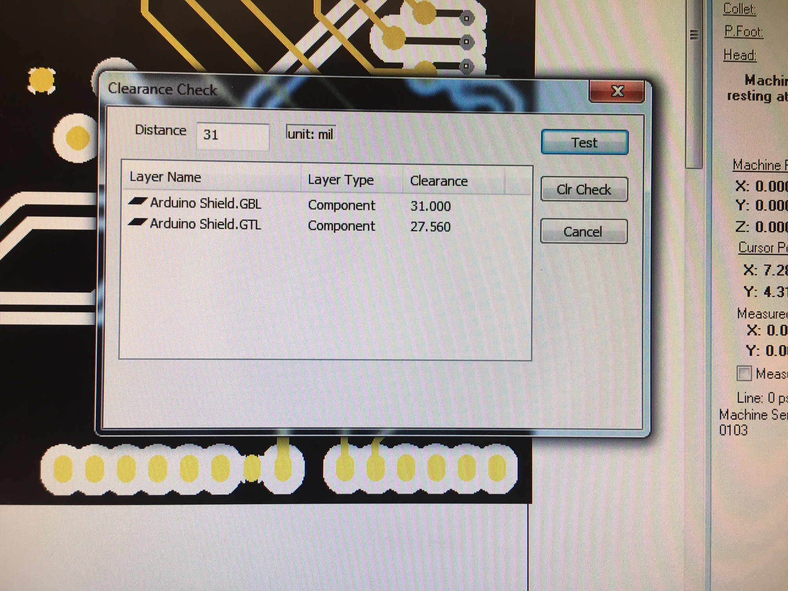
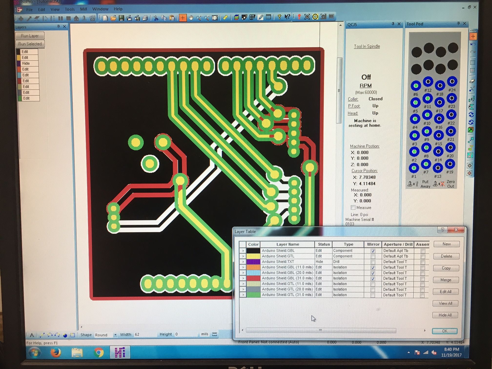
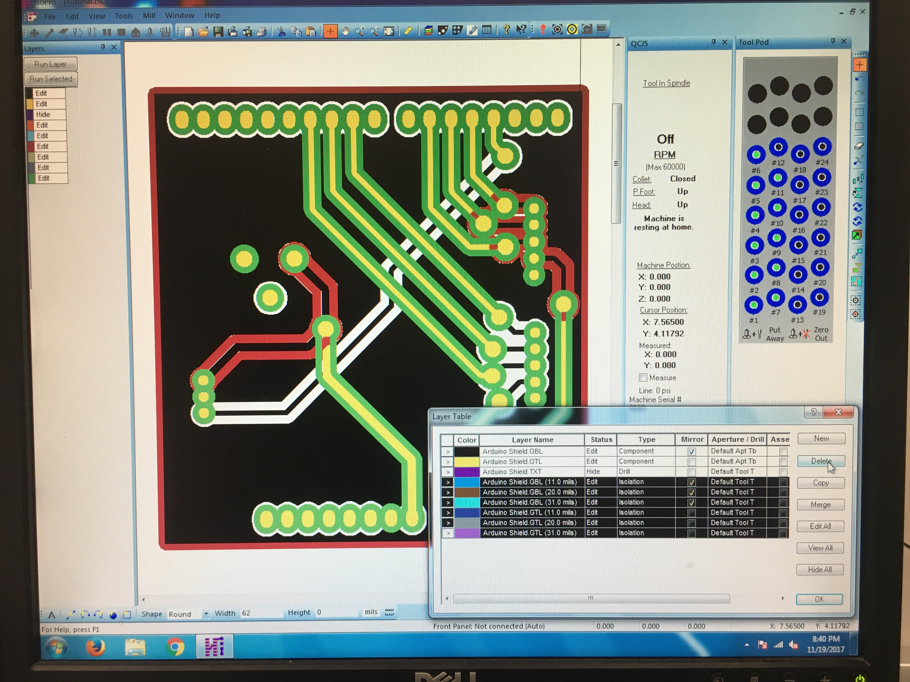
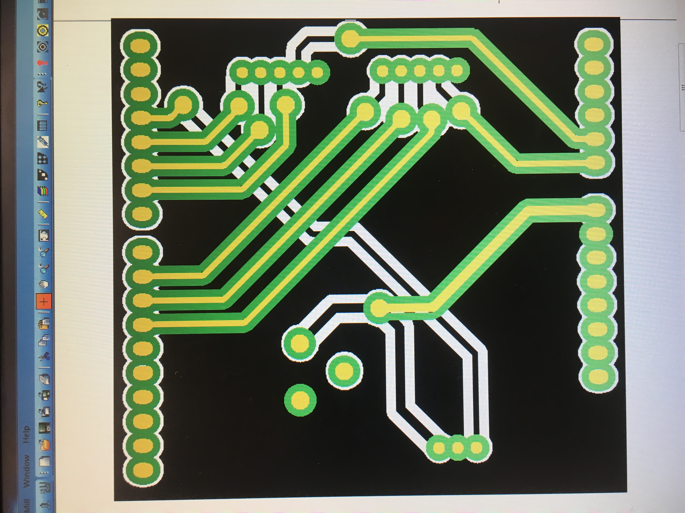
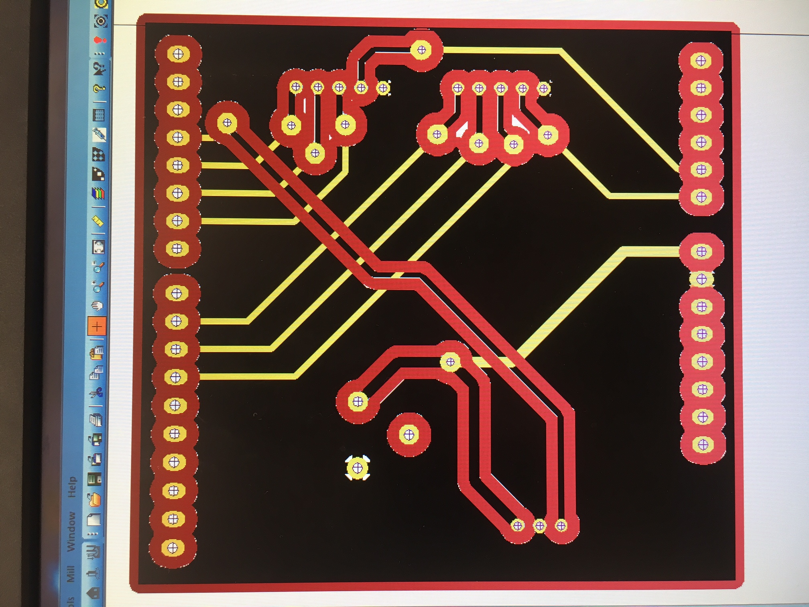
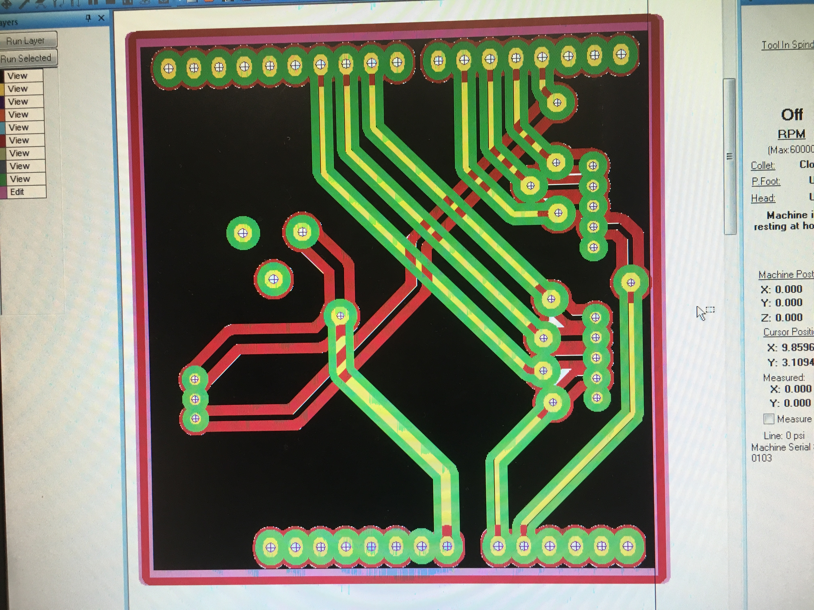
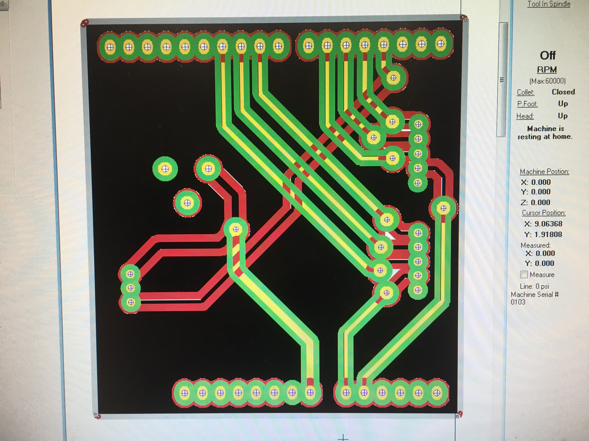

PCB Mill Tutorial (In progress..)
by Daniel Edens, Oct. 27th, 2017

Introduction
The QCJ5 Quick Circuit Mill delivers the precision, speed, and automation required to take your prototype to the next level. Making a board on the mill enhances your PCB designing and machine skills. It’s also exciting to watch your board created live. The main difference between a milled board and a PCB is that a PCB is a sheet of dielectric material with copper placed as traces and pads, and a milled board has copper on the entire plane of two faces with a dielectric in between and traces and pads are defined by cuts. On the milled board, cuts are made through the copper and into the dielectric to completely isolate any sections of copper.

Part of the Maker Space?
If you are already part of the Maker Space, trained on the PCB mill, and want to mill out your own PCB, we can provide you with 1- or 2-layer boards. The cost of these will count against your final budget. Please send Kirstin an email with the approximate size of the board you want, and how many layers of copper you need (1 or 2).
Please designate one person from your team to learn how to use and work on the PCB mill. This will allow more teams to have at least one trained member. You can contact <did Daniel Edens graduate?> to request training. Include your team number in the email.

Designing a Layout
Be sure to check out Leah’s lecture slides on layout design and (Leah’s tutorial). Your layout design for the mill will be slightly different than an optimal PCB. For instance, a via on a milled board is created by drilling a hole and inserting and squishing a pin into the hole, so a header or through hole component cannot have traces on the same layer as itself since the component pins and the pin cannot exist in the same hole. This means that the trace must connect to the component pins on the opposite layer of the component as shown in figure 2. Please keep this in mind in your design. You may have to add vias to your board to make this possible. Figure 1 and 2 show this setup.

Figure 1: Arduino Uno Milled Shield Top

Figure 2: Arduino Uno Milled Shield Bottom

PCB Mill Tutorial
This tutorial is based on the  and goes more into detail on all the steps with pictures and extra steps not covered in the manual. Please read and understand this tutorial before training to maximize your learning experience. Also skim the online manual from page 8 to 32.

1) Importing Gerber Files
The only gerber files you need are the top layer .GTL, bottom layer .GBL, and drill which may be a .DRL or .TXT file. You will have to try .DRL and .TXT to see which works.
Place your gerber files in “Desktop/Mill Project Files/<your net id folder>/<project name>” shown in Figure 3. Open the ISOPro Software. If the software doesn’t load, restart the computer and try again. In the software, click “File > Import > Auto-detect File(s)”. Navigate to your gerber files and select the .GTL, .GBL, and .TXT or .DRL files.

Figure 3

Import your gerber files using Auto Import.

Figure 4

Select the .GBL, .GTL, and .txt Drill file (if this drill file doesn't work, try a different drill file in your gerber output)

Figure 5

Select the size fo your PCB. The software believes the PCB could be one of these sizes.

Figure 6

Click view->Layer Table

Figure 8

Click view->Tool Table, and change the size of drill bit.

Figure 9

Figure 10

Figure 11

Figure 12

Figure 13

Figure 14

Figure 15

Figure 16

Figure 17

Figure 18

Figure 19

Figure 20

Figure 21

Figure 22

Figure 23

Figure 24

Figure 25

Figure 26

Figure 27

Figure 28

Figure 29

Figure 30

Figure 31

Figure 32

Figure 33

Figure 34

Figure 35

Figure 36

Figure 37

Figure 38

Figure 39

Figure 40
