PCB Mill Tutorial (In progress..)
by Daniel Edens, Oct. 27th, 2017

Introduction
The QCJ5 Quick Circuit Mill delivers the precision, speed, and automation required to take your prototype to the next level. Making a board on the mill enhances your PCB designing and machine skills. It’s also exciting to watch your board created live. The main difference between a milled board and a PCB is that a PCB is a sheet of dielectric material with copper placed as traces and pads, and a milled board has copper on the entire plane of two faces with a dielectric in between and traces and pads are defined by cuts. On the milled board, cuts are made through the copper and into the dielectric to completely isolate any sections of copper.

Part of the Maker Space?
If you are already part of the Maker Space, trained on the PCB mill, and want to mill out your own PCB, we can provide you with 1- or 2-layer boards. The cost of these will count against your final budget. Please send Kirstin an email with the approximate size of the board you want, and how many layers of copper you need (1 or 2).
Please designate one person from your team to learn how to use and work on the PCB mill. This will allow more teams to have at least one trained member. You can contact <did Daniel Edens graduate?> to request training. Include your team number in the email.

Designing a Layout
Be sure to check out Leah’s lecture slides on layout design and (Leah’s tutorial). Your layout design for the mill will be slightly different than an optimal PCB. For instance, a via on a milled board is created by drilling a hole and inserting and squishing a pin into the hole, so a header or through hole component cannot have traces on the same layer as itself since the component pins and the pin cannot exist in the same hole. This means that the trace must connect to the component pins on the opposite layer of the component as shown in figure 2. Please keep this in mind in your design. You may have to add vias to your board to make this possible. Figure 1 and 2 show this setup.

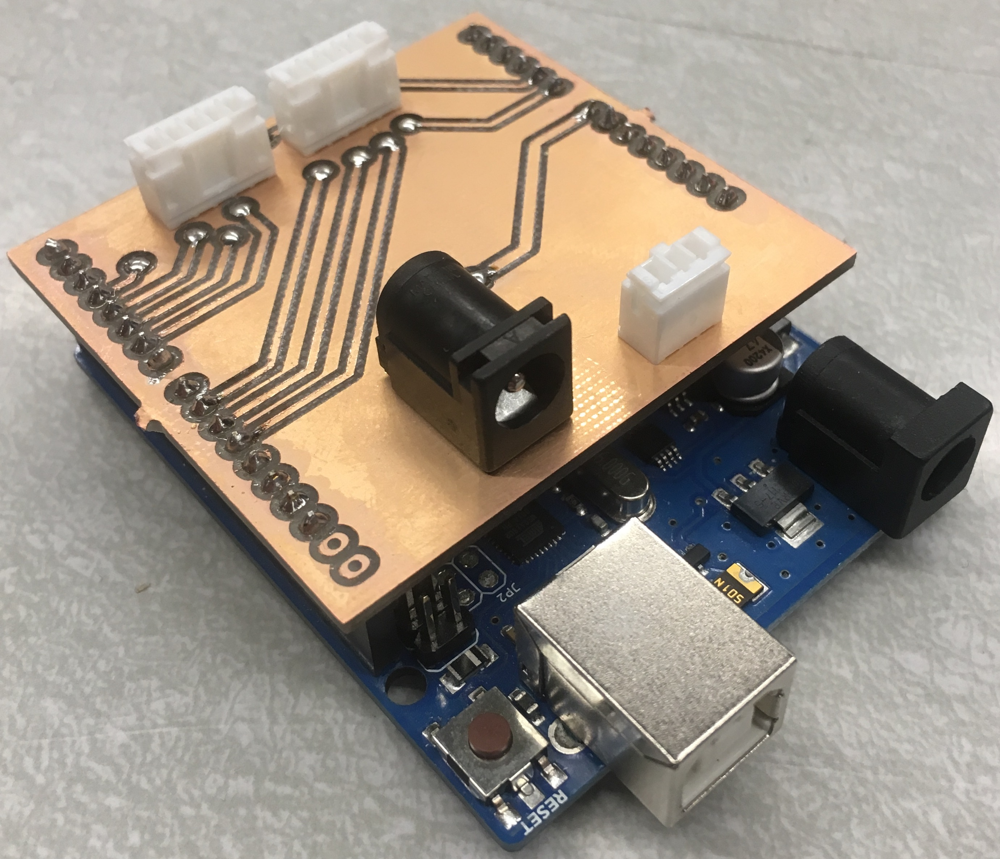
Figure 1: Arduino Uno Milled Shield Top

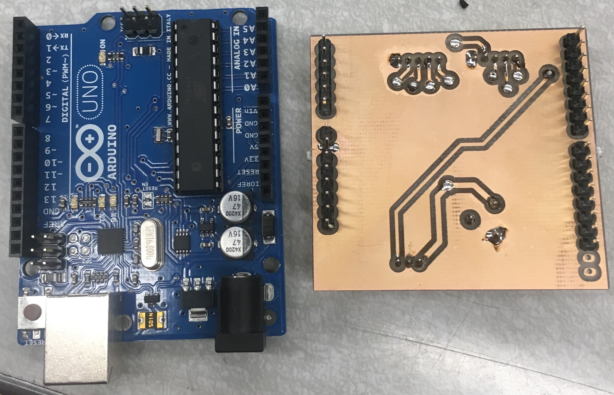
Figure 2: Arduino Uno Milled Shield Bottom

PCB Mill Tutorial
This tutorial is based on the  and goes more into detail on all the steps with pictures and extra steps not covered in the manual. Please read and understand this tutorial before training to maximize your learning experience. Also skim the online manual from page 8 to 32.

1) Importing Gerber Files
The only gerber files you need are the top layer .GTL, bottom layer .GBL, and drill which may be a .DRL or .TXT file. You will have to try .DRL and .TXT to see which works.
Place your gerber files in “Desktop/Mill Project Files/<your net id folder>/<project name>” shown in Figure 3. Open the ISOPro Software. If the software doesn’t load, restart the computer and try again. In the software, click “File > Import > Auto-detect File(s)”. Navigate to your gerber files and select the .GTL, .GBL, and .TXT or .DRL files.

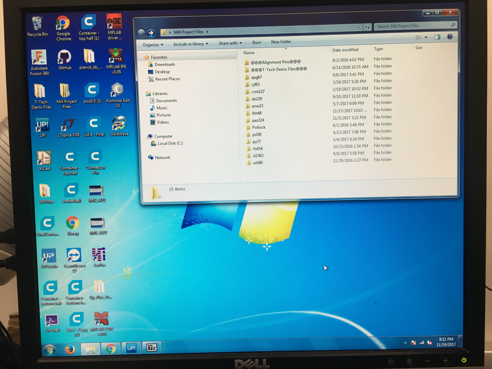
Figure 3

Import your gerber files using Auto Import.
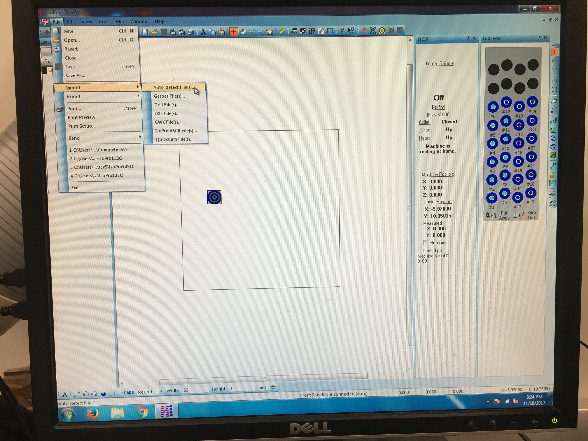
Figure 4

Select the .GBL, .GTL, and .txt Drill file (if this drill file doesn't work, try a different drill file in your gerber output)
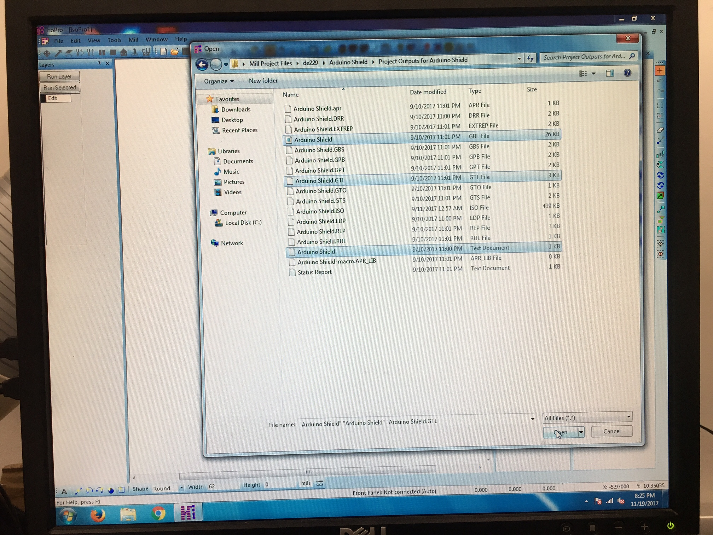
Figure 5

Select the size fo your PCB. The software believes the PCB could be one of these sizes.
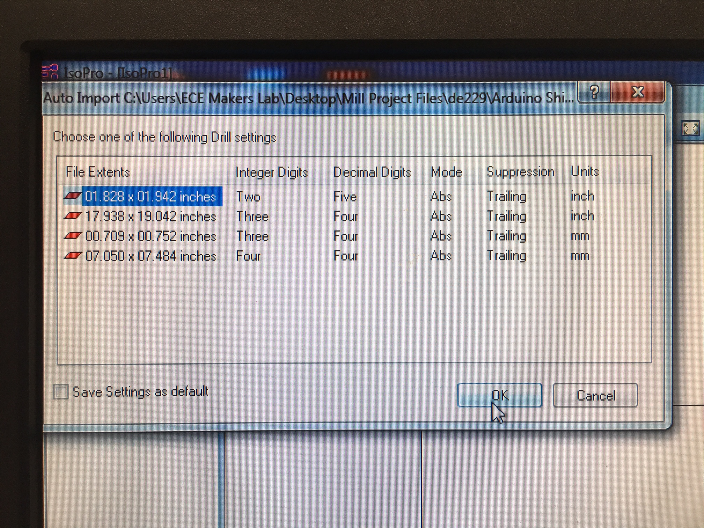
Figure 6

Click view->Layer Table. Familiarize yourself with this table. You will use it often.
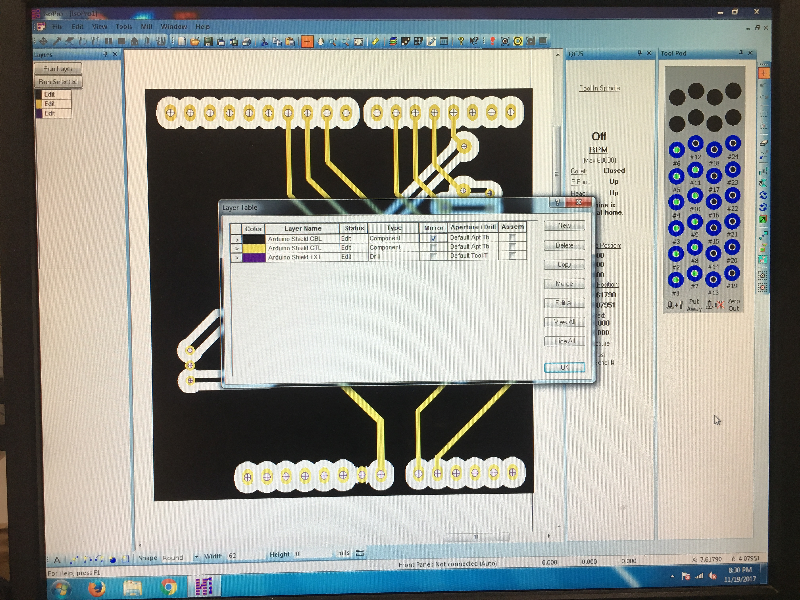
Figure 8

Click view->Tool Table, and change the size of drill bits to match what is in the Tool Pod list. The PCB Mill can only drill hole sizes that it has drill bits for. Warning, this will change the size of the holes on your PCB, so make sure you verify that the change in hole size works for your design.

Figure 9

Changed the 28mil bit to a 32mil, and the #2 shows up in the Tool Pod# column.

Figure 10

Inspect your design for flaws on import. You cannot edit your design here. The software is not designed to do that.
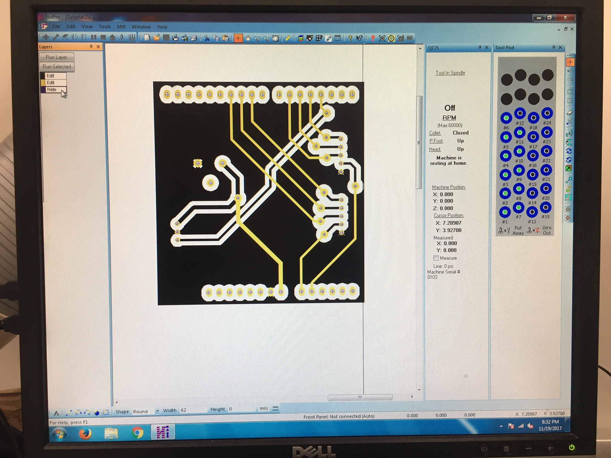
Figure 11

This shows my design when I set only the bottom layer to "hide" in the layer table. I am inspecting for flaws.
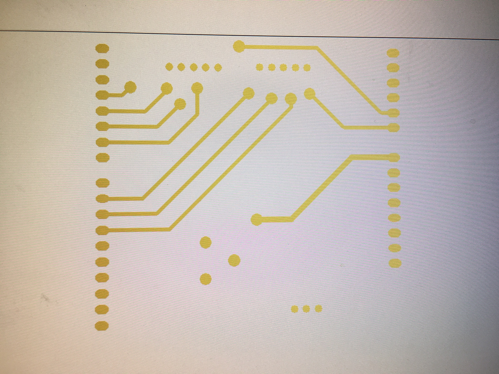
Figure 13

This shows my design when I set only the top layer to "hide" in the layer table. I am inspecting for flaws.
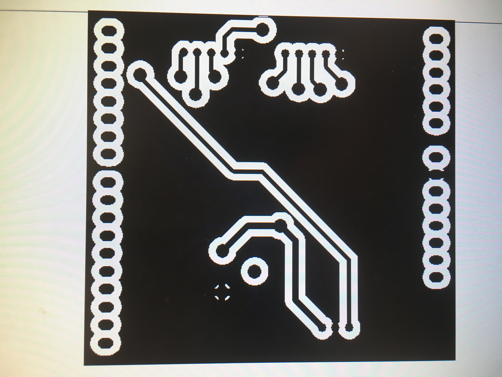
Figure 14

Click Tools->Clearance Check, and run the clearance check with a number that is the smallest gap between any two pads or traces. For example, if the smallest gap is an IC with width of 10mils between its pads, run this clearance check with 10mils.
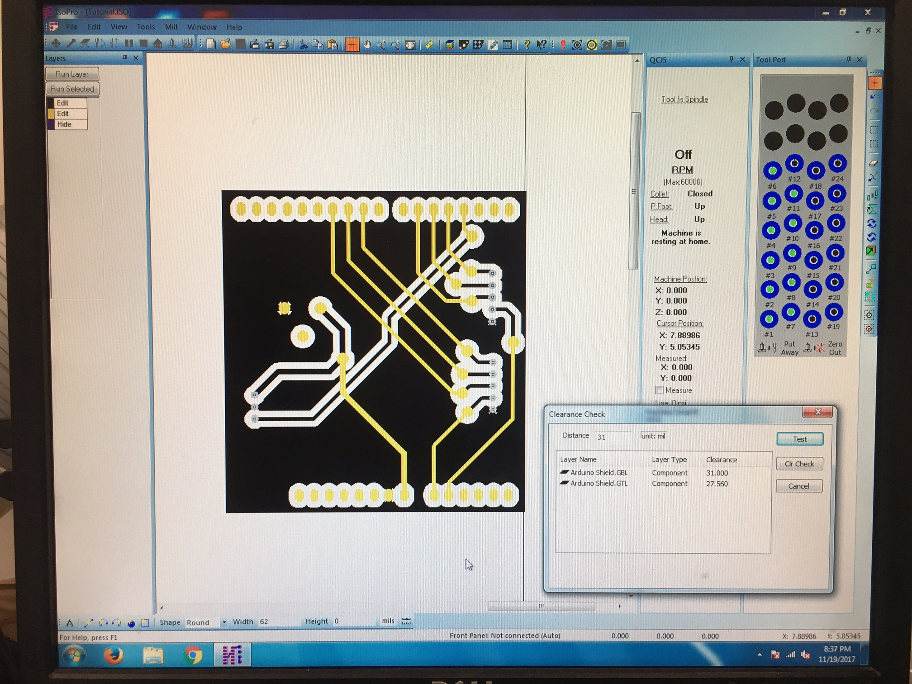
Figure 16

After you are satisfied with the import of your gerber files, it is time to generate isolation layers. The purpose of the isolattion is to generate mill paths around your traces and solder pads. The PCB Mill will take an end mill of a width you will choose in a later step and will cut copper and isolate your traces and pads.

Only the layers are to be isolated. Dill file is just holes. Click Tools->Isolate. Select the top and bottom layers and set the endmill sizes in the tool size column. You can find the sizes of end mills that are in the PCB Mill pods by viewing the Tool Table under the view tab. I always use the 11mil, 20mil, and 31mil endmills for my boards. I recommend you do the same for your first board unless you desire to do it your own way. Click the checkbox for "Remove Redundant Area." In this example, if you do not check this, the PCB Mill will run the 11mil along all the traces, then the 20mil along most of the traces, and then the 31mil. This will triple the time it takes to mill your PCB and will wear out the endmills quickly. Essentially, the "Remove Redundant Area" box will generate isolations that only use the endmill where it is needed. The 11mil will only cut in little gaps and corners where neither the 20mil or 31mil can reach but will not cut anywhere else. The 20mil will cut only in places where the 31mil cannot reach and where the 11mil didn't go. The 31mil will cut the remaining isolation in places where only the 31mil can fit.

Lastly, make sure you select END MILL for tool type. Now click Isolate.

Figure 17

In this image, my isolation failed. As you can see there are white gaps between my traces and ground plane. This is common for the software to do this. If this occurs, go to layer table, delete the isolation layer, save your project, close the software, reopen the software, and repeat the steps for isolating the layers.
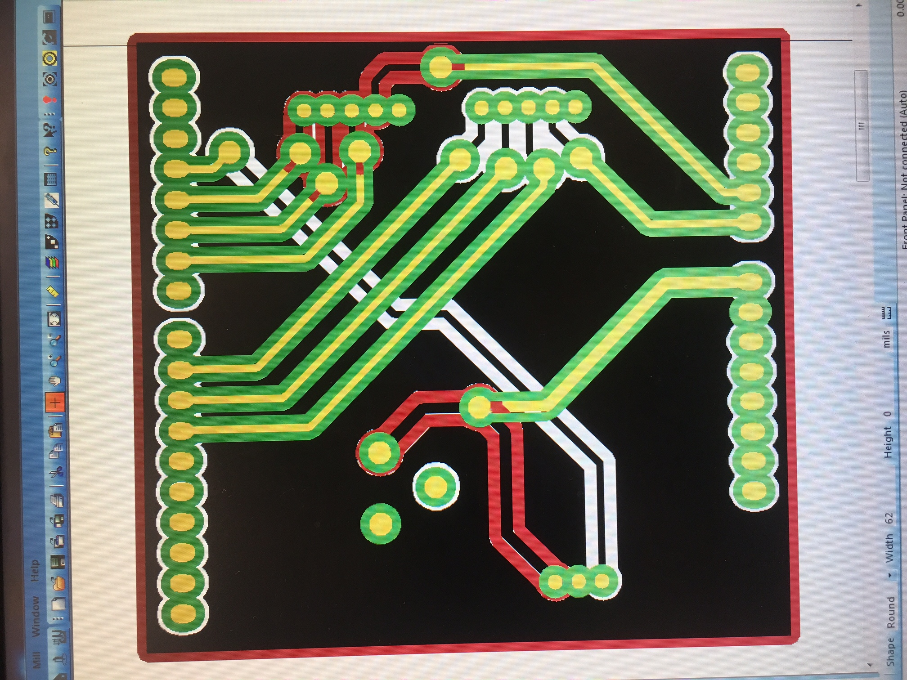
Figure 18

I followed the steps just mentioned and second time around all the gaps are filled with isolation layers. Note that there are some white gaps on the right side of the PCB layout. This is okay because the gap is enclosed by the isolation and does not connect to any of my traces or solder pads. This gap exists since it is not necessary to mill out an entire section of copper.
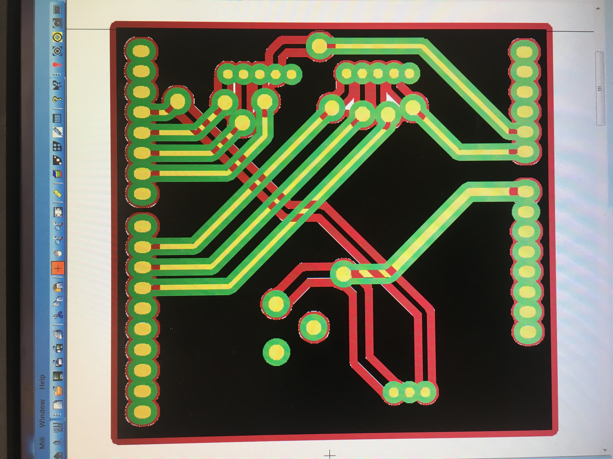
Figure 21

In this image I hid the top layer isolation and top layer to make it easier to inspect the bottom layer isolation.
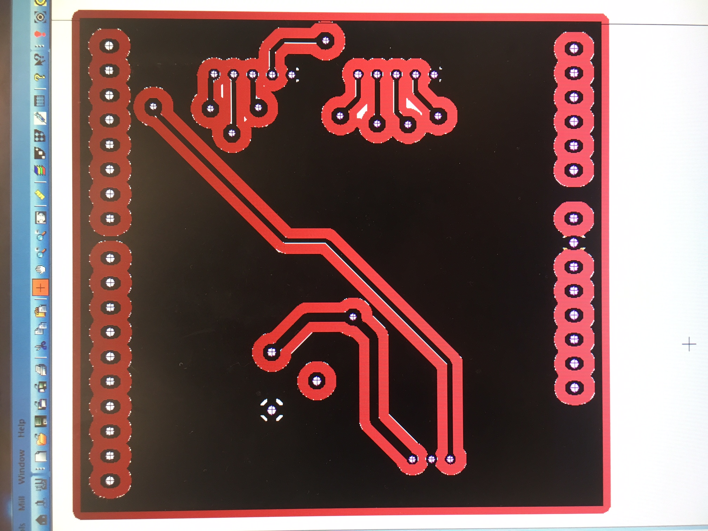
Figure 24

In this image I hid the bottom layer isolation and bottom layer to make it easier to inspect the top layer isolation.
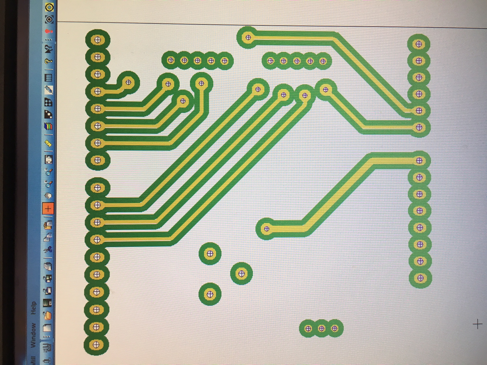
Figure 25

Open the layer table and make sure the bottom layer isolations are set to layer mode. This step is necessary for milled on the bottom side of the PCB. If your PCB is one layer, you can skip this step.

Figure 26

The milled PCB is cut out of the copper sheet but running a router around its perimiter. To do this, open the layer table and set all your layers to view mode. Create a new layer called Border and set it to edit mode. Select the rectangle on the bottom left of the screen, the shape to round, and the width to 62mils.
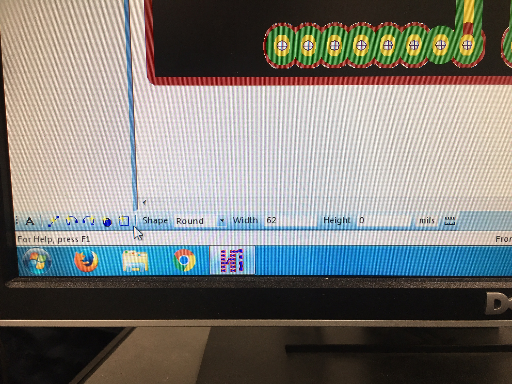
Figure 27

Place a rectangle around your pcb layout. The outer edge of this line will be size of your PCB.
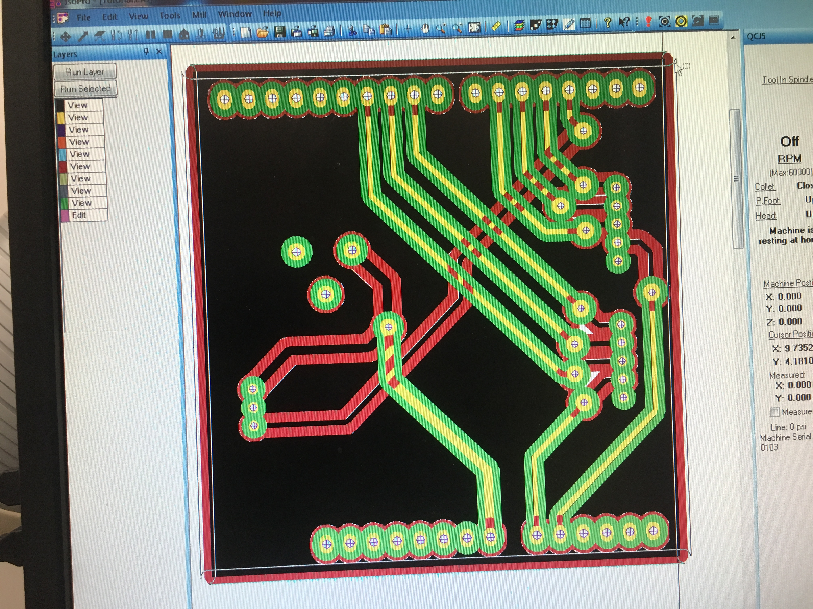
Figure 28

Select all. This should only select the rectangle you made since all the other layers are in view mode.
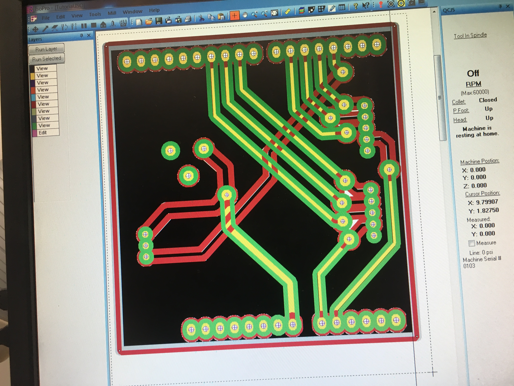
Figure 30

Click edit->convert to polygon to convert the rectangle into a solid polygon.

Figure 31

Now isolate the polygon. Click Tools->Isolate, select the Border layer, tool size 62mils, remove redundant area, and select the counter router tool.
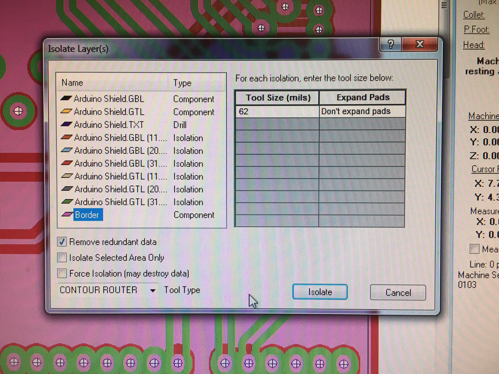
Figure 32

This is the result after isolation the Border layer.

Figure 33

To simplify the milling process, let's merge your layers. Open the layer table. Select all the bottom layer isolations and click merge. Label the merged file as "GBL Merged Layer". Select all the top layer isolations and the drill file (note I forgot to select the drill file in this example). Click merge. Label the merged file as "GTL + Drill Merged Layer".

Figure 35

Figure 36

Set all layers to hide except for the merged layers.

Figure 37

Inspect your isolations and verify that the surround the shape of your traces and pads. If you have any discontinuities in your traces or pads, you will not have a connection. This could be a result of inclduing a mechanical layer while using IsoPro.
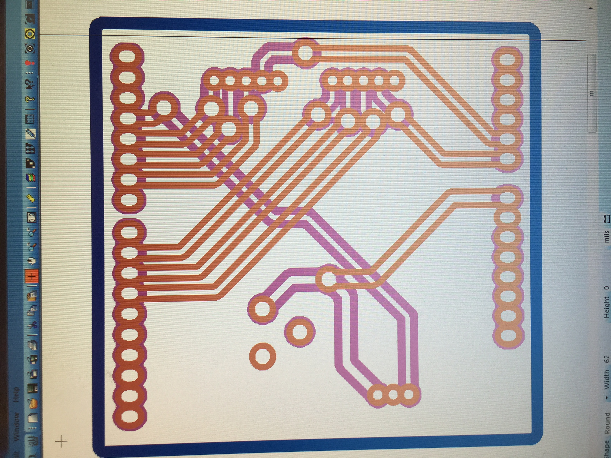
Figure 38

We do not want to cut out the entire PCB with the router tool. If you skip this step, the PCB will pop out of the sheet when the router trims the last remaining portion of the Border isolation and can damage the PCB Mill and your board.

Click Tools->Clip and clip off 100mils in the center of the longer edges of your PCB. Do this while the Border isolation is in edit mode and the other layers are in view mode.

Figure 39

This is a properly trimmed board.
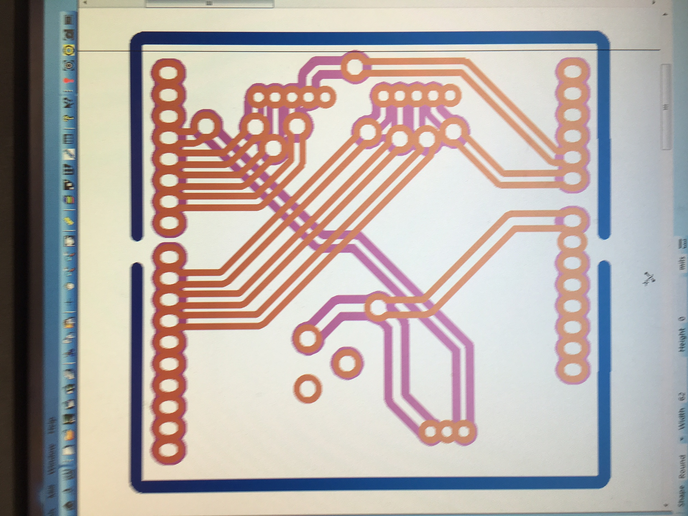
Figure 40

To be continued....Sorry
